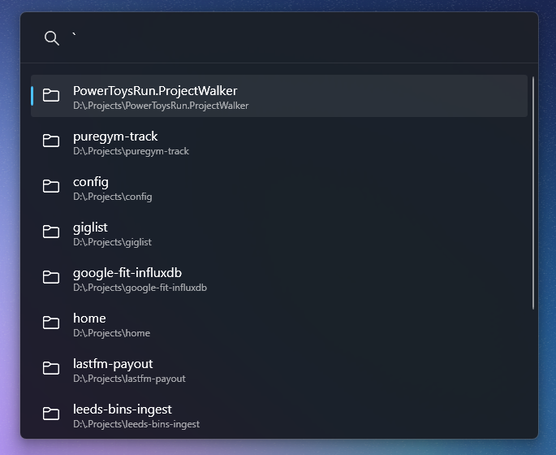
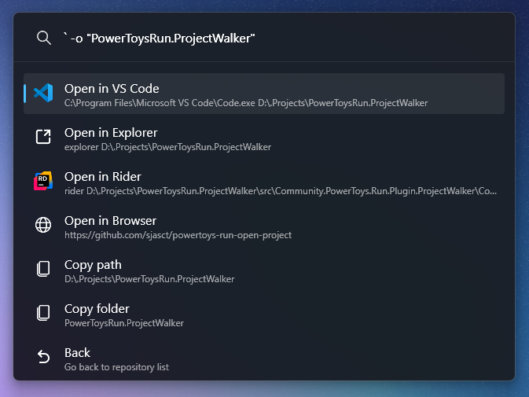

# ProjectWalker
A plugin for [PowerToys Run](https://github.com/microsoft/powertoys) that lets you navigate your local copy of repositories and perform various actions, such as opening in IDE or your browser.

> [!NOTE]  
> This was made for my own personal use. It is far from optimised, slightly jankey, and tailored to my specific use case. The project may be expanded in the future, for example with new features in the PowerToys Run API, but this should not be classed as a project with ongoing suopport.

### Install
1. Stop PowerToys
2. Download latest .zip from the releases page
3. Drop the downloaded zip in `%LOCALAPPDATA%\Microsoft\PowerToys\PowerToys Run\Plugins`
4. Extract the zip, so that the `ProjectWalker` folder is under `Plugins`
5. Relaunch PowerToys


### Screenshots

**Project Results**  


**Open Options**  


### Configuration
On first launch, a config file will be created at `%APPDATA%/ProjectWalker/config.json` with some default options. You can reload and open the config file in Notepad / VS Code by starting your search with `-c`.

`basePath` - `string`  
This will need to be set to the folder path where your repos live.  
*e.g. if a sample repo path is `C:\dev\project-name\repo-name`, then `basePath` should equal `C:\dev`*

`ignoredFolders` - `string[]`  
A list of folders you don't want including in the results

`folderStructureType` - `int`  *default `1`*  
Defines how your repo folders are structured

*Options:*  
`0`: Repos are organised into parent project folders e,g, `C:\base\project-name\repo-name`   
`1`: All repos live directly under the base directory e.g. `C:\base\repo-name` (default)

`customEditorExecutablePath` - `string` *(optional)*  
Path to an executable to open when the "open config with custom editor" is used. This option will not show if this isn't populated.

`searchMatchRatio` - `int` *default `70`*  
Ratio (between 1-100) needed to match folders according to the search term, based on fuzzy search. If the value is high (80-100s for example), the more accurate the results will be. A lower value will be more forgiving with typos and substrings.

`tryExtractProcessIcons` - `bool` *default `false`*  
If a process option does not have a custom icon set, when this option is set to true, it will try to extract the icon from the process. *This isn't always reliable and might give low quality icons.*

`openOptions` - `openOptions[]` *see below*

### Open Options  
These are the set of options you receieve when selecting a project. 

#### Examples

**Open sln file in Rider**

```JSON
{
    "type": "process",
    "name": "Open Solution",
    "processName": "rider",
    "iconPath": "rider.png",
    "parameters": "{{FILE:*.sln}}"
}
```

**Copy path to clipboard**

```JSON
{
    "type": "clipboard",
    "name": "Copy Path",
    "parameters": "{{PATH}}"
}
```

**Open git remote in browser**

```JSON
{
    "type": "browser",
    "name": "Open Remote",
    "parameters": "{{GIT:REMOTE_URL}}"
}
```

**Supported Variables**  
- `{{PATH}}` - The full path to the repo folder
- `{{FOLDER}}` - The currently selected folder name
- `{{GIT:REMOTE_URL}}` - The remote URL for the Git repo
- `{{FILE:x}}` - Find 1st file with a specific filter (replacing `x`) in the top level folder e.g. `{{FILE:*.sln}}` will find the 1st .sln file. 
- `{{RECURSIVE_FILE:X}}` - Same as `{{FILE:x}}` except all subfolders are searched, instead of just the top-level folder. 

If a variable is used in an option, but cannot be applied (e.g. not a git repo, no suitable file found) the option will not show.

**Icons**  
All options support custom icons with the `iconPath` property. This can either be an absolute path to an image (i.e. `C:\icons\sample.png`) or relative to the plugin icons folder which is located at `%APPDATA%/ProjectWalker/icons/`.

Options of process type also support trying to extract the icon from the process executable, however this is disabled by default as it's not always reliable and doesn't give high quality icons most of the time. You can enable this by setting the config flag `tryExtractProcessIcons` to `true`. Extracted icons are stored in the cache folder `%APPDATA%/ProjectWalker/icons/cache`, which will need to be cleared if a process has changed it's icon.

#### Libraries Used

- [FuzzySharp](https://github.com/JakeBayer/FuzzySharp)
- [libgit2sharp](https://github.com/libgit2/libgit2sharp)
- [Community.PowerToys.Run.Plugin.Dependencies](https://github.com/hlaueriksson/Community.PowerToys.Run.Plugin.Dependencies) (build only)
- [fluentui-system-icons](https://github.com/microsoft/fluentui-system-icons)